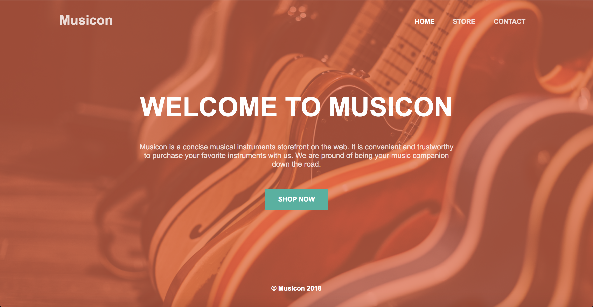
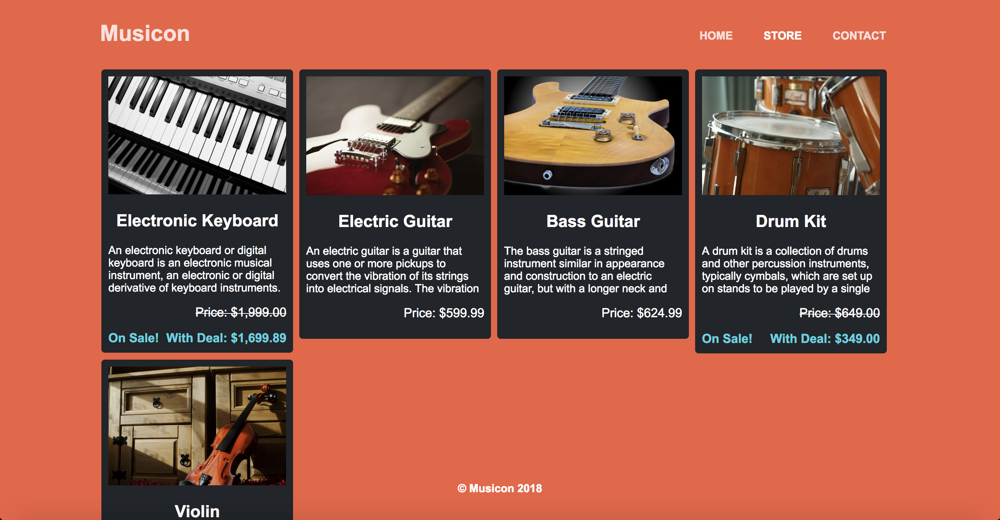
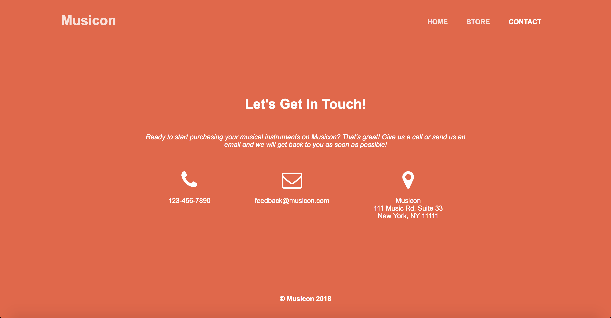

# Musicon

*Milestone Project for Codecademy Pro's Web Development Path:* A 3-page musical instruments storefront on the web

It is built in Handlebars, JavaScript, CSS and HTML.

## Instructions

1. Clone this repo using `git clone https://github.com/Junjie-Chen/musicon.git`.
2. Move to the root directory: `cd musicon`.
3. Move to the solution-code directory: `cd solution-code`.
4. Open `index.html` under the solution-code directory using a local server of your choice. If you're using **Visual Studio Code**, you can find and install the `Live Server` extension within VSC itself using the Extensions panel (⌘⇧X or the square icon in the left sidebar).
5. See the application at `http://127.0.0.1:5500/solution-code`.

## UI

